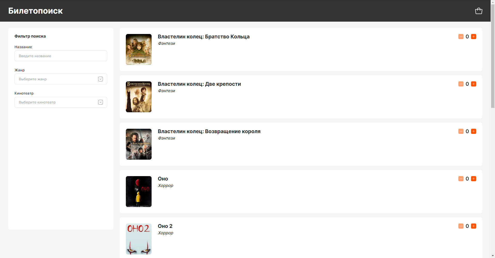

# Biletopoisk

The project was made at the Yandex interface development school

## Development

1. install npm dependencies

`npm ci`

2. run development build

`npm run back:dev` for backend and `npm run front:dev` for frontend
